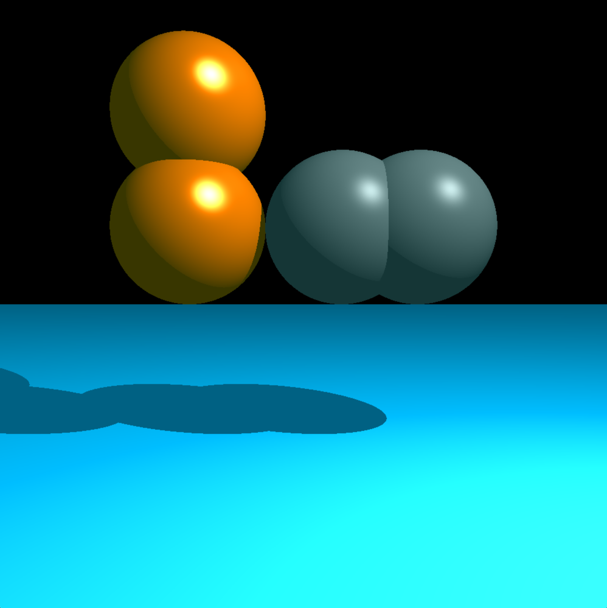
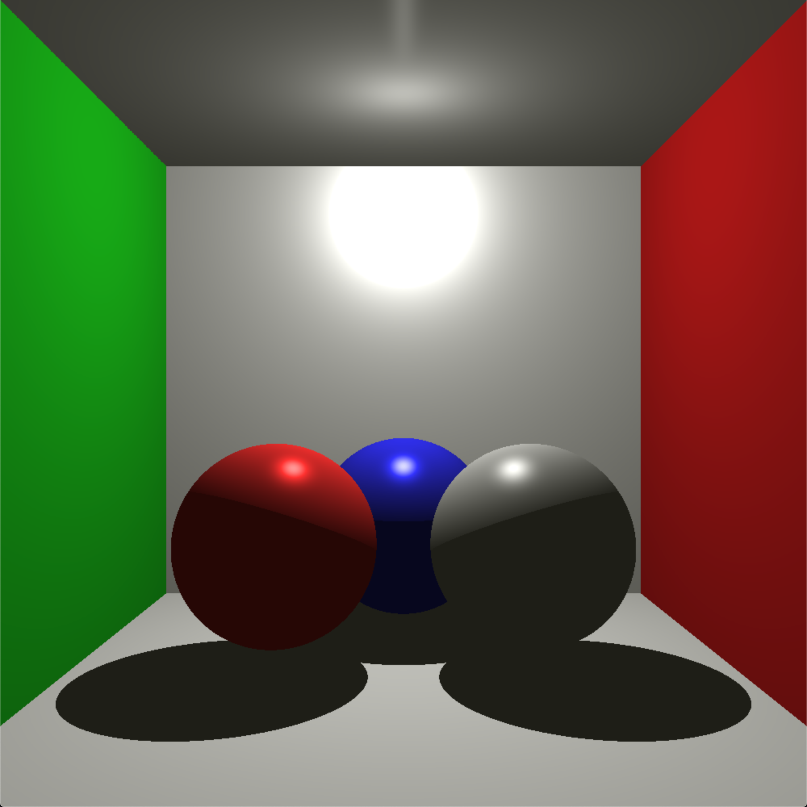
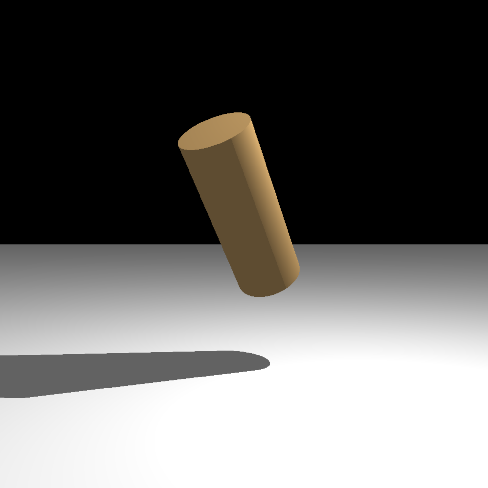

# MiniRT
<!--  -->

<!--  -->

<!--  -->

## 🤓 Overview
Finally! A sexy project! Where have you been all my life?

Who can take a small text file and turn it into a 3D rendering? Me and [This Guy](https://github.com/sakarisalmi/). It's rather impressive since we both had extremely limited experience with anything graphics-related. It's *even more impressive* that we didn't kill each other.

But we did think about it...a lot.

## 🧐 So What's the Deal?
- **`Example Scenes`** : are available in the scenes directory.

If we thought FDF was math-heavy, boy did we have another thing coming. This was math-redonkulous, and required crash courses in matrices, trigonometry, perspective, three-dimensional coordinate systems, radians, and pretending to be professional.

#### How to use it:
`git clone [this repo]`

`git submodule update --init --recursive` (there's a few more things you need)

`cd bonus` (it's more interesting)

`make`

Wait for a hot minute while everything compiles. MinilibX will throw *a ton of warnings*, go ahead and ignore them just like we did.

## 💻 Compilation
To compile:

```make```

Remove the object files:

```make clean```

Remove everything:

```make fclean```

# `🥳 Fun Things We Learned:`
- Planning is the most important thing. EVER.
- Linked Lists are crazy slow and should only be used in emergencies.
- Allocating is for chumps! All stack, all the time. (except where forbidden).
- [Phong Reflection Model](https://en.wikipedia.org/wiki/Blinn%E2%80%93Phong_reflection_model) Kinda crazy that adding those slight reflections makes everything look so much better.
- Git Branching. ALL THE TIME. What has four thumbs and never over-wrote their partner's work? 👍👍These guys👍👍.

## 📷 Preview
Here is a visual representation of what the program does. These are screenshots






## 🤡 Usage
```
`./miniRT ../scenes/mandatory/[some_file.rt]`
```
You can also make your own .rt files, there are a few restrictions, but the program will complain when you do something wrong, so go nuts.

### 📝 License
Go nuts.
